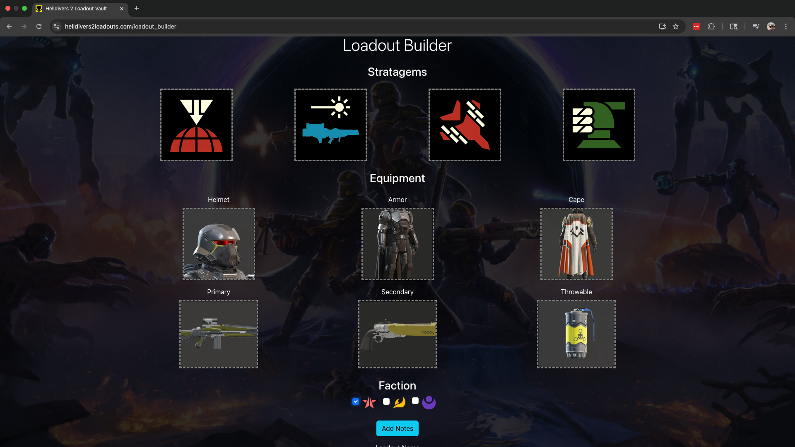
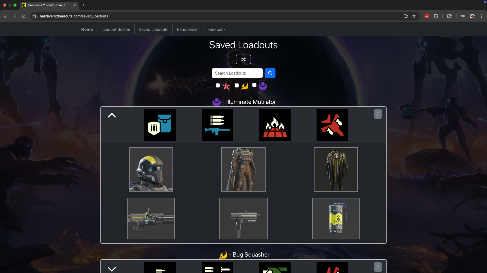

# Helldivers 2 Loadouts

changing something

### “A Helldiver Without a Loadout Is Just a Corpse in Uniform.” - General Brasch, Super Ten-Star General

In service of Liberty, welcome to the Loadout Vault.

This is your armory, Helldiver — a place to craft, save, and perfect your loadouts for every righteous mission across the galaxy. Whether you're dropping into a bug-infested warzone or dismantling bot resistance one stratagem at a time, your gear is your greatest weapon in the fight for Managed Democracy.

Customize your arsenal. Prepare for deployment. And show the enemies of Super Earth what true freedom looks like.

Remember: Liberty isn’t given — it’s dropped from orbit with extreme prejudice.

Approved by the Ministry of Expansion™

## Features
- Build and save loadouts to local storage.
- View all saved loadouts or sort by faction.
- Search bar to quickly find a loadout. Search by name, stratagem, weapon, etc. 
- Randomize your loadout for a challenge with the randomizer.

## Planned Features
- 🚧 Cloud storage using firestore with firebase (in progress)

## 📍 Live Site
Try it out [here](helldivers2loadouts.com)

## 📸 Demo




## 📦 Tech Stack

- React
- FontAwesome
- Bootstrap
- React-Bootstrap

## 🛠️ Setup Instructions

### 1. Clone the Repository

```bash
git clone https://github.com/stephendoty826/HD2LV.git
cd yourproject
```

### 2. Install Dependencies

```bash
cd HD2LV
npm install
```

### 4. Run the App

```bash
npm start
```

### 👨🏻‍💻 Author
Created by Stephen Doty

## 🛡️ License

This project is licensed under the [MIT License](./LICENSE).
